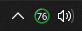

# LogiBAT


# Disclaimer

This is an early prototype that was only tested with single logitech device.
It can be untsable, it can crash, it can cause all kind of issues.

### Features

-  Displays an icon in your notification area (system tray) of battery of your selected Logitech wireless device
-  Hovering over the icon displays battery status of all Logitech devices currently plugged in the pc
-  Option to change default device (of which to show battery status)
-  All number status icons were generated using a script so they are not under any license and are completely free to use, change or do anything you please with them
- Different color of icon **(red 0-10, blue 11-50, green 51-100)**
- You can replace icons simply by replacing files in the **/ico** folder


## Requirements

- Logitech G HUB [Official Website](https://www.logitechg.com/en-eu/innovation/g-hub.html 'LOGITECH G HUB') 

- NPM [Official Website](https://www.npmjs.com/ 'NPM')

- NodeJS [Official Website](https://nodejs.org/en/ 'NodeJS') 

*Logitech G HUB has to be running all the time for this widget to work*

## How does it work

First of all, this app **DOES NOT** inject into G HUB. G HUB runs websocket server **(ws://localhost:9010)** in the background, most likely to provide data to other apps, websites etc. We can listen to this websocket server and send request to it. This app only sends 2 requests in intervals to get battery state and keep it up to date.

```javascript
   ...
   this.ws = new WebSocket('ws://localhost:9010', 'json');

   getDeviceList() {
      this.ws.send(JSON.stringify({ path: '/devices/list', verb: 'GET' }));
   }

   requestBatteryState(deviceId) {
        this.ws.send(
            JSON.stringify({
                path: '/battery/' + deviceId + '/state',
                verb: 'GET',
            }),
        );
    }
    ...
    this.ws.on('message', (data) => {
        var json = JSON.parse(data);

        if (json.path == '/devices/list'  && json.result.code == 'SUCCESS') {
                json.payload.deviceInfos.forEach((device) => {
                this.requestBatteryState(device.id);
            });
        }

        if (json.path.includes('/battery/') && json.path.includes('/state') && json result.code == 'SUCCESS') {
            var deviceId = json.path.replace('/battery/', '').replace('/state', '');
            var percentage = json.payload.percentage;
            //deviceId, percentage variables ready for use
        }
    });
    ....
```

----

## Images ##

[](gitassets/demo1.jpg 'Demo 1')

[](gitassets/demo2.jpg 'Demo 2')

# Download and Installation
Get precompiled binary and assets on Release Page https://github.com/someweirdhuman/LogiBAT/releases/


# Build it yourself

### **Windows only**
Clone this repository and install dependencies
```
$ git clone https://github.com/someweirdhuman/LogiBAT/
$ cd LogiBAT
$ npm install
```

Build the project
```
$ npm run build
```

Copy assets (**ico**) to the binary folder (**bin/ico**)
```
$ xcopy ico bin/ico
```

Launch the program
```
$ .\LogiBAT_patched.exe
```


# Issues

This project is new and thus will have many issues. If you would like for any of them to get fixed, or you would like new feature to get added then please create new bug report/feature request on issue page https://github.com/someweirdhuman/LogiBAT/issues 
